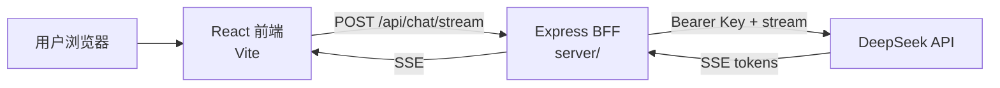

# AI Chat Assistant

基于 React + Express BFF 的流式 AI 聊天应用。  
前端负责会话 UI / 状态；服务端保管 API Key，代理大模型流式响应。

## 功能

### 核心对话

- 多会话聊天（新建 / 切换 / 重命名 / 删除）
- SSE 流式输出、流式光标、Markdown 渲染（`rehype-sanitize` 防 XSS）
- 多轮上下文 + 最近 N 条裁剪、默认 system prompt
- 设置页模型切换（DeepSeek）、聊天页显示当前模型

### 会话与数据

- 导出当前会话（JSON / Markdown）
- 会话内消息关键词搜索

### 健壮性

- 请求重试（401 不重试）、离线提示、ErrorBoundary
- 防连点发送、Abort 后清理空气泡

### 工程

- 消息列表虚拟滚动（react-virtuoso）
- Express BFF 转发（API Key 不进浏览器）
- 设置页路由 lazy 加载

## 技术栈

- 前端：React、TypeScript、Vite、Zustand、React Router、react-markdown、react-virtuoso
- 后端：Express（`server/`）
- 模型：DeepSeek（OpenAI 兼容接口）
- 测试：Vitest（`src/utils/errors.test.ts`）

## 架构



## 目录分层

- `src/api/`：外部请求（如 LLM 流式调用）
- `src/stores/`：全局状态（chat / settings）
- `src/hooks/`：组合 api + store 的业务逻辑（如发消息、重试）
- `src/pages/`：路由页面，负责拼装
- `src/components/`：可复用 UI，不直接调 LLM
- `src/utils/`：纯工具（如 SSE 解析、导出、裁剪）

## 工程化

### 环境变量

- 前端只允许 `VITE_` 前缀变量（如 `VITE_BFF_URL`）
- 本地：复制 `.env.example` 为 `.env.development` / `.env.local`
- 生产构建：使用 `.env.production`
- API Key 放在 `server/.env`，不要写成 `VITE_`

**`server/.env` 示例（勿提交真实 Key）：**

    LLM_API_BASE=https://api.deepseek.com
    LLM_API_KEY=sk-你的Key
    PORT=3001
    # 可选，逗号分隔多个前端地址
    # CORS_ORIGIN=http://localhost:5173,http://localhost:5175

**前端 `.env.development` 示例：**

    VITE_BFF_URL=http://localhost:3001

### 路径别名

- `@/` 指向 `src/`（Vite `resolve.alias` + `tsconfig` `paths`）
- 示例：`import { useChat } from "@/hooks/useChat"`

### 代码检查与测试

```bash
npm run lint
npm test
```

- 提交时 husky `pre-commit` 会自动执行 lint
- 当前为全量 `eslint .`；项目变大后可接入 **lint-staged**，只检查本次暂存的文件以加快提交

### 提交规范（Conventional Commits）

格式：`<type>: <description>`

常用 type：`feat` / `fix` / `chore` / `perf` / `docs` / `refactor`

- husky `commit-msg` 会跑 commitlint，不合格的 message 无法提交

### 提交链路

```text
改代码 → git add → git commit
  → pre-commit: npm run lint
  → commit-msg: commitlint
  → 通过后生成 commit
```

## 本地启动

### 1. 安装依赖

```bash
npm install
```

### 2. 配置环境变量

- 前端：参考 `.env.example`，配置 `VITE_BFF_URL`（见上方示例）
- 服务端：在 `server/.env` 配置 `LLM_API_KEY` 等（见上方示例）

### 3. 启动

```bash
# 同时启动前端 + BFF
npm run dev:all

# 或分开启动
npm run dev
npm run server
```

前端默认：http://localhost:5173  
BFF 默认：http://localhost:3001

> **注意**
>
> - Vite 若 5173 被占用，会改用 5174/5175；BFF 默认已放行常见端口，或通过 `CORS_ORIGIN` 自定义。
> - 设置页请选择 **`deepseek-chat`**（当前 BFF 对接 DeepSeek；`gpt-4o-mini` 等会返回 `INVALID_MODEL`）。
> - 健康检查：`GET http://localhost:3001/health`

### 快速验证

1. 打开聊天页，发一条消息，应看到流式输出与末尾光标
2. 设置页换模型，header 显示对应模型名
3. 搜索框输入关键词，列表过滤
4. 导出 JSON，文件可打开

## 项目亮点（面试可讲）

1. **SSE 全链路**：前端 `fetch` 读流 → BFF 代理上游 → token 逐字追加 UI
2. **BFF 设计**：Key 只在服务端；前端只调 `/api/chat/stream`；统一错误码（如 `INVALID_MODEL`）
3. **自定义 `useChat`**：Abort、指数退避重试、多轮 + system + 裁剪
4. **工程化**：TS strict、Vitest、ErrorBoundary、lazy 路由、Markdown 消毒
5. **产品细节**：导出 / 搜索 / 多模型 / 离线提示 / 边界 case 处理

## 生产部署

当前线上：**Cloudflare Pages（前端）+ Render（BFF）**。  
每次怎么发、访问地址与排错见 **[docs/deploy.md](./docs/deploy.md)**。

### 访问地址

| 用途 | URL |
|------|-----|
| 正式前端 | https://ai-chat-assistant-1c5.pages.dev |
| 设置页 | https://ai-chat-assistant-1c5.pages.dev/settings |
| BFF | https://ai-chat-assistant-k7fb.onrender.com |
| BFF 健康检查 | https://ai-chat-assistant-k7fb.onrender.com/health |

### 每次发前端（正式站）

```powershell
npm run build
npx wrangler pages deploy dist --project-name=ai-chat-assistant --branch=main --commit-dirty=true
```

> 必须用项目名 **`ai-chat-assistant`** + **`--branch=main`**。发到 `ai-chat-assistant-1c5` 或漏写 `main` 都不会更新正式站。

### 每次发后端（Render BFF）

1. 将含 `server/` 的提交推到 Render 所连仓库分支（通常 `main`；若开了 Auto-Deploy 会自动发）
2. 或打开 [Render Dashboard](https://dashboard.render.com) → 对应 Web Service → **Manual Deploy**
3. 探活：https://ai-chat-assistant-k7fb.onrender.com/health

**首次创建**：按 **[docs/deploy.md](./docs/deploy.md)**「一、BFF：Render New Web Service 填表」填写（Language=Docker、Branch=main、Root Directory 留空、环境变量见文档）。

改 CORS / `LLM_*`：Render → **Environment** 保存后按需再 Manual Deploy。

面试话术 / Week13 预习：`docs/interview.md`、`docs/fastapi-prep.md`。
