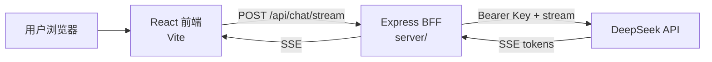

# AI Chat Assistant

基于 React + Express BFF 的流式 AI 聊天应用。  
前端负责会话 UI / 状态；服务端保管 API Key，代理大模型流式响应。

## 功能

- 多会话聊天、设置页模型选择
- SSE 流式输出、Markdown 渲染、长消息折叠
- 消息列表虚拟滚动
- Express BFF 转发（Key 不进浏览器）

## 技术栈

- 前端：React、Vite、Zustand、React Router、react-markdown、react-virtuoso
- 后端：Express（`server/`）
- 模型：DeepSeek（OpenAI 兼容接口）

## 架构



## 目录分层

- `src/api/`：外部请求（如 LLM 流式调用）
- `src/stores/`：全局状态（chat / settings）
- `src/hooks/`：组合 api + store 的业务逻辑（如发消息、重试）
- `src/pages/`：路由页面，负责拼装
- `src/components/`：可复用 UI，不直接调 LLM
- `src/utils/`：纯工具（如通用 SSE 解析）

## 工程化

### 环境变量

- 前端只允许 `VITE_` 前缀变量（如 `VITE_BFF_URL`）
- 本地：复制 `.env.example` 为 `.env.development` / `.env.local`
- 生产构建：使用 `.env.production`
- API Key 放在 `server/.env`，不要写成 `VITE_`

### 路径别名

- `@/` 指向 `src/`（Vite `resolve.alias` + `tsconfig` `paths`）
- 示例：`import { useChat } from "@/hooks/useChat"`

### 代码检查

```bash
npm run lint
```

- 提交时 husky `pre-commit` 会自动执行上述命令
- 当前为全量 `eslint .`；项目变大后可接入 **lint-staged**，只检查本次暂存的文件以加快提交

### 提交规范（Conventional Commits）

格式：`<type>: <description>`

常用 type：`feat` / `fix` / `chore` / `perf` / `docs` / `refactor`

- husky `commit-msg` 会跑 commitlint，不合格的 message 无法提交

### 提交链路

```text
改代码 → git add → git commit
  → pre-commit: npm run lint
  → commit-msg: commitlint
  → 通过后生成 commit
```

## 本地启动

### 1. 安装依赖

```bash
npm install
```

### 2. 配置环境变量

- 前端：参考 `.env.example`，配置 `VITE_BFF_URL`
- 服务端：在 `server/.env` 配置 `LLM_API_KEY` 等

### 3. 启动

```bash
# 同时启动前端 + BFF
npm run dev:all

# 或分开启动
npm run dev
npm run server
```

前端默认：http://localhost:5173  
BFF 默认：http://localhost:3001
